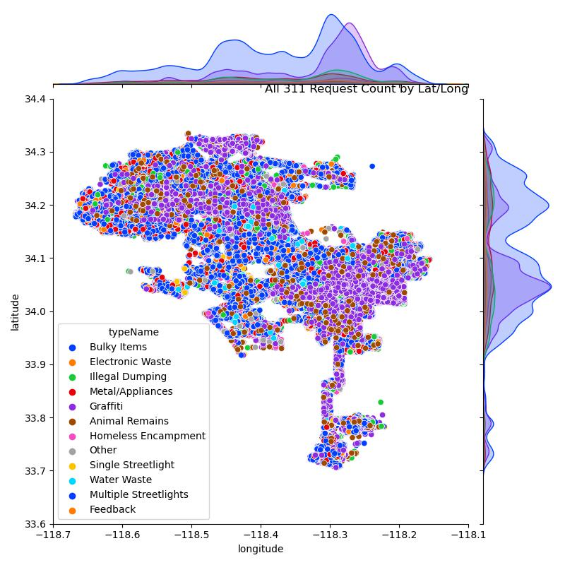

# Hack for LA - [311 Data Project](https://www.hackforla.org/projects/311-data.html) - [I-1279](https://github.com/hackforla/311-data/issues/1279) - Analyzing hotspots for 311 Requests by Adriana Machado
---
Identify addresses or small areas that could benefit from more signage, increased community assistance, or other actions related to 311

# Overview
Hack for LA has partnered with the City of LA to update the city's [311 portal (dev link)](https://dev.311-data.org/map). As a part of this effort, I contributed this data science project to provide templates for analyses on the 311 data. 

Data was pulled using python script which [pulls from the 311 API, using a time frame](https://github.com/hackforla/311-data/blob/dev/server/utils/get_request_data_csv.py) from October 2021 to October 2022. The dataset contained 1,042,208 data points, aka 311 requests.

Exploratory data analysis was performed and various types of folium maps were created to visualize the 311 request data by Neighborhood Council and Census block. Clustering was tested but found to not be as useful as simple EDA. A streamlit app is [IN PROGRESS].

Here are some summary charts using matplotlib based on all 311 requests. More summary charts based on locations with greater than 2 requests and locations with greater than 5 requests can be found in the images folder. 

Folium maps with geospatial analysis layers can be found in various notebooks (see Data Descriptions section below).

 ## All Requests

 ### Jointplot Showing Type Clusters by Latitudes and Longitudes for the City of LA
 

### Top 20 Neighborhood Councils for 311 Request Counts
 

### Summary Chart of 311 Request Counts by Request Type
 

# Pulling a Report of 311 Requests with Census Block Identifiers

This csv report is available to be used in Excel with a standard pivot table. The goal is to make this accessible to anyone who may want to do their own analyses with Census block level identifiers. 

The [get_nc_blk_req tool](https://github.com/ajmachado42/Hack-for-LA-311-Data/tree/master/I-1279/get_nc_blk) was created to generate a csv report for more localized analysis of 311 requests. This python script my be run on the command line (with the full repo)--it will clean any dataset pulled, from the API referenced above, and merge that data set with block level geometries from the US 2020 Census, to create a csv that contains each 311 request's address and its corresponding unique Census block ID.

# Data Descriptions
---

| Filename/Folder | Type | Description |
| --------------- | ---- | ----------- |
| 01_00_nc_api_cleaning | .ipynb | API dataset from 10/01/21-10/01/22 cleaning |
| 01_01_nc_eda | .ipynb | Exploration of 311 requests by Neighborhood Council - all requests, addresses w/ >= 2 requests, addresses w/ >= 5 requests, timeseries by NC |
| 01_02_block_eda | .ipynb | Exploration of requests by block created in 02_00_geospatial_cleaning |
| 02_00_geospatial_cleaning | .ipynb | Cleaning of geodata for Neighborhood Council and 2020 Census block boundaries; spatial merge w/ NC and block boundaries; spatial merge w/ 311 request address point geometry and block geometries | 
| 02_01_nc_only_viz | .ipynb | Folium choropleth map with 311 request data by Neighborhood Council; layered choropleth map by type by Neighborhood Council; addresses dropped that did not have a certified NC |
| 02_02_block_only_viz | .ipynb | Folium choropleth map with all 311 request data by Census block; addresses dropped that did not have a matching census block |
| 02_03_nc_blk_viz | .ipynb | Folium choropleth map with all 311 Request data by Neighborhood Council and Census block; Census blocks use  quantile bins for the legend |
| 03_00_clustering | .ipynb | Sample of full request dataset; DBScan to identify clusters; classification model from clusters coming soon? |
| get_311_request_data_csv | .py | [get_311_request_data_csv.py](https://github.com/hackforla/311-data/blob/dev/server/utils/get_request_data_csv.py) for timeframe API pulls; replace datetime, as necessary; cmd line - python get_311_request_data_csv.py "2021-10-01" "2022-10-01" |
| get_nc_blk | folder/.py | cmd line program to filter and merge request data w/ block IDs |
| images | folder | Various charts from EDAs |
| streamlit | folder | Contains .py file for streamlit app and .html files of Folium maps used in streamlit |
